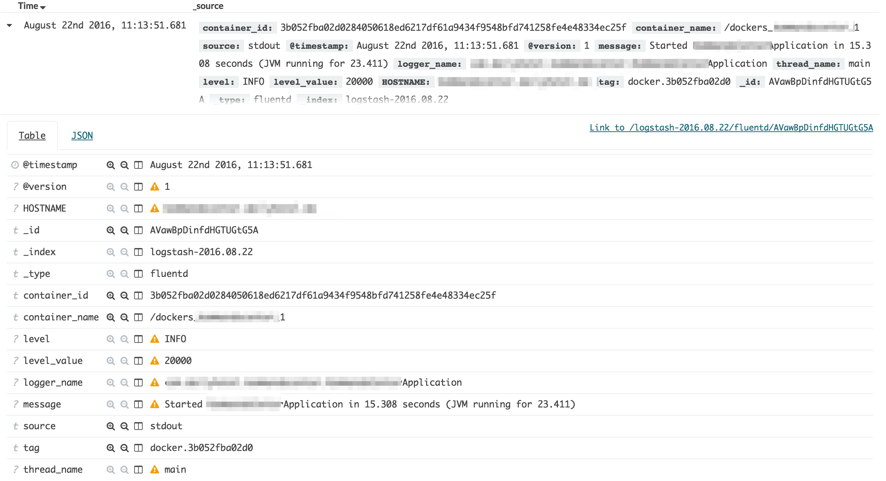

# Dockerized Fluentd

이 Docker 이미지는 로깅 에이전트인 Fluentd를 포함한다. 주된 역할은

1. Docker의 콘솔 로그를 수집하고
2. 원본 로그를 적절한 형태로 가공한 후
3. Elasticsearch에 전송

하는 것이다. 소위 *Centralised logging for Docker*라 하는 물건을 Fluentd로 구현한 것이다.

## 결과 확인하기

수집한 데이터는 Elasticsearch의 Kibana에 쌓는다. AWS의 Elasticsearch 서비스를 이용하거나 도커로 간단히 Elasticsearch + Kibana 조합을 구성해서 결과를 확인하면 된다.

## 설치하기

이 이미지는 도커 데몬에 하나만 띄우면 된다. 나머지 도커 컨테이너의 로그를 자동으로 수집한다.

### Standalone Docker daemon인 경우

```bash
docker run -v /var/lib/docker:/var/lib/docker -p 24224:24224 --name fluentd dailyhotel/fluentd-for-elasticsearch:latest
```

이와 같이 Fluentd 컨테이너를 띄운 후, 로그를 수집해야 하는 다른 도커 컨테이너를 띄울 때 [`log-driver`를 `fluentd`로 지정한다.](https://docs.docker.com/engine/admin/logging/fluentd/)

```bash
docker run --log-driver=fluentd mysql
```

### Docker Compose를 쓰는 경우

```yml
version: '2'
services:
  fluentd:
    image: dailyhotel/fluentd:latest
    environment:
      ES_HOST: elasticsearch.dailyhotel.com
      ES_PORT: 443
      ES_SCHEME: https
    ports:
      - 24224:24224
    restart: always

  mysql:
    image: mysql
    ports:
      - 3306:3306
    links:
      - fluentd
    logging:
      driver: fluentd
```

### AWS ECS인 경우

기본적인 과정은 [Datadog-AWS ECS Integration](http://docs.datadoghq.com/integrations/ecs/)와 동일하다.

1. Task Definition [`fluentd-task`](aws/fluentd-task.json)를 AWS ECS에 등록한다.

    ```bash
    aws ecs register-task-definition --cli-input-json file://aws/fluentd-ecs.json
    ```

2. ECS 클러스터와 연결된 Auto Scaling Group의 Launch Configuration을 수정한다. User Data를 수정해 Fluentd 도커 컨테이너를 자동실행한다.

    1. 우선 `/etc/ecs/ecs.config` 파일에 다음 항목이 들어가야 한다.

        ```bash
        ECS_AVAILABLE_LOGGING_DRIVERS=["json-file","syslog","fluentd"]
        ```

    2. `/etc/rc.local` 에는 다음 항목이 필요하다.

        ```bash
        aws ecs start-task --cluster $cluster --task-definition fluentd-task --container-instances $instance_arn --region $region
        ```

최종 User Data 값은 다음과 같은 형태가 된다.


```bash
#!/bin/bash
cluster="MY_ECS_CLUSTER"
task_def="fluentd-task"

cat <<EOT >> /etc/ecs/ecs.config
ECS_CLUSTER=$cluster
ECS_AVAILABLE_LOGGING_DRIVERS=["json-file","syslog","fluentd"]
EOT

start ecs
yum install -y aws-cli jq
instance_arn=$(curl -s http://localhost:51678/v1/metadata \
  | jq -r '. | .ContainerInstanceArn' | awk -F/ '{print $NF}' )
az=$(curl -s http://169.254.169.254/latest/meta-data/placement/availability-zone)
region=${az:0:${#az} - 1}
echo "
cluster=$cluster
az=$az
region=$region
aws ecs start-task --cluster $cluster --task-definition $task_def \
  --container-instances $instance_arn --region $region >> /etc/rc.local
```

### Kubernetes인 경우

기본적인 과정은 [Datadog-Kubernetes Integration](http://docs.datadoghq.com/integrations/kubernetes/)와 동일하다.

```yaml
apiVersion: extensions/v1beta1
kind: DaemonSet
metadata:
  name: fluentd
spec:
  template:
    metadata:
      labels:
        app: fluentd
      name: fluentd
    spec:
      containers:
      - image: dailyhotel/fluentd-for-elasticsearch
        imagePullPolicy: Always
        name: fluentd
        ports:
          - containerPort: 24224
            name: fluentdport
            protocol: TCP
        env:
          - name: "ES_HOST"
            value: "elasticsearch.dailyhotel.com"
          - name: "ES_PORT"
            value: "443"
          - name: "ES_SCHEME"
            value: "https"
```

위와 같이 `fluentd.yaml` 파일을 생성한 후에 `kubectl`로 `DaemonSet`을 띄우면 된다.

```bash
kubectl --kubeconfig=./kubeconfig --namespace=kube-system create -f ./fluentd.yaml
```

## 애플리케이션 로깅

**콘솔 로그를 사용한다.** 파일 로그는 수집하지 않는다. 그리고 로그를 좀더 세밀하게 남기고 싶다면 [logstash-logback-encoder](https://github.com/logstash/logstash-logback-encoder) 같은 도구를 사용하여 JSON 포맷으로 로그를 남긴다.

```bash
mybootapp_1  | {"@timestamp":"2016-08-22T11:13:51.674+09:00","@version":1,"message":"Tomcat started on port(s): 8080 (http)","logger_name":"org.springframework.boot.context.embedded.tomcat.TomcatEmbeddedServletContainer","thread_name":"main","level":"INFO","level_value":20000,"HOSTNAME":"mybootapp.dailyhotel.com"}
mybootapp_1  | {"@timestamp":"2016-08-22T11:13:51.681+09:00","@version":1,"message":"Started mybootappApplication in 15.308 seconds (JVM running for 23.411)","logger_name":"com.dailyhotel.mybootapp.mybootappApplication","thread_name":"main","level":"INFO","level_value":20000,"HOSTNAME":"mybootapp.dailyhotel.com"}
```

위와 같이 로그를 남기면 Kibana에 아래와 같이 기록이 남는다.




## 세부 구현

크게 Plaintext와 JSON 두 가지 형태의 로깅을 파싱하는데 중점을 뒀다. 평문 로그의 경우 Multiline을 서로 다른 로그가 아닌 하나의 로그 레코드로 분류해내야 한다. 로그 종류에 따라 파싱방법이 다르겠지만 우선 [Docker Logging](http://www.fluentd.org/guides/recipes/docker-logging)에서 제시한 대로 구현한다.

```xml
<filter docker.**>
  @type concat
  key log
  stream_identity_key container_id
  multiline_start_regexp /^-e:2:in `\/'/
  multiline_end_regexp /^-e:4:in/
</filter>
```

JSON 형태의 애플리케이션 로그는 별도의 처리를 하지 않으면 Kibana에 다음과 같이 기록된다.


그래서 [mark-adams/lift_json.rb](https://gist.github.com/mark-adams)를 이용하여 2차로 파싱한다.


### Elasticsearch 템플릿

검색 템플릿은 아래와 같이 구현했으나 향후 튜닝의 여지가 많다.

```bash
curl -k -XPUT http://elasticsearch.dailyhotel.com/_template/app -d '
{
"template": "app*",
"settings": {
"index" : {
    "refresh_interval": "5s",
            "number_of_replicas" : 0
}
  },
"mappings": {
"_default_": {
            "dynamic_templates": [
                {
                    "template1": {
                        "mapping": {
                            "ignore_above": 1024,
                            "index": "not_analyzed",
                            "type": "{dynamic_type}",
                            "doc_values": true
                        },
                        "match": "*"
                }
            }
            ],
            "_all": {
                "norms": {
                "enabled": false
                },
                "enabled": true
            },
            "properties": {
                "@timestamp": {
                    "type": "date",
                    "format" : "date_time"
                },
                "offset": {
                    "type": "long",
                    "doc_values": "true"
                },
                "message": {
                    "index": "analyzed",
                    "type": "string"
                              }
        }
  }
}
'
```


## 대안

### 파일 로그 수집하기

Fluentd logging driver는 몇 가지 단점이 있다.

- 도커 1.8부터 사용가능하며
- 애플리케이션 도커 이미지의 설정을 바꿔서 Fluentd에 로그를 보내게 해야 한다.
- 게다가 도커의 기본 로거인 `json-file`로 로그가 가지 않기 때문에 `docker logs`와 같은 명령은 더이상 유효하지 않다.

  ```bash
  [ec2-user@ip-172-16-1-223 ~]$ docker-compose logs -f mybootapp
  Attaching to ec2user_mybootapp_1
  ERROR: configured logging reader does not support reading
  ```

이는 `/var/lib/docker/containers/*/*-json.log` 파일을 수집하는 방법으로 손쉽게 해결가능하다. 다만 이 방법에도 단점이 있다.

- 해당 로그 파일의 이름이 컨테이너 이름(예, `mybootapp`)이 아닌 해시해시값인 컨테이너 아이디를 포함하므로 제대로 된 정보를 수집하고 파싱하려면 고생 꽤나 해야 한다. [gliderlabs/logspout](https://github.com/gliderlabs) 같은 프로젝트가 있으나 최신 버전에 [exec: "gcc": executable file not found in $PATH status: needs more info](https://github.com/gliderlabs/logspout/issues/223)와 같은 버그가 있어서 커스터마이징하려면 이 역시 고생이다.
- 잘못하면 Fluentd를 담은 컨테이너 로그까지 수집해서 자기가 자기 자신의 로그를 분석하고 또 그렇게 분석한 내용이 로그로 남아 불필요한 로그를 무한히 쌓는 수가 있다.

### Filebeat

[Elastic의 Filebeat](https://www.elastic.co/products/beats/filebeat)의 경우

* 개발 초기라 참고할 문서가 적고
* 도커의 로깅 드라이버 지원을 못 받는

문제 등이 있어 Fluentd를 쓰게 됐다. Fluentd는 플러그인이 많아 다양한 애플리케이션 로그에 대응하기 쉽다는 장점도 있다.

### Fluentd 플러그인

아래의 플러그인은 도입을 검토했으나 이런저런 이유로 참고만 했다.

* [gmr/fluent-plugin-json-in-json](https://github.com/gmr): deprecated 되어서 도입하지 않는다.
* [fluentd-elasticsearch-container/plugins/json_in_string.rb](https://github.com/oosidat/fluentd-elasticsearch-container): 제대로 작동하지 않는다.


## 참고 문헌

* [Docker Logging](http://www.fluentd.org/guides/recipes/docker-logging): Multiline log를 처리하는 방법과 Fluentd logging driver 사용법을 다룬다.
* [Logging in AWS Elastic Container Services (ECS)](https://medium.com/centricient-blog/logging-in-aws-elastic-container-services-ecs-21ce7781be18#.ynuvxqzsd)는 User Data 등과 관련한 이슈를 잘 설명한다.

## 향후 과제

- [ ] [배포 환경을 구분하는 태그를 추가한다.](http://docs.fluentd.org/articles/filter-modify-apache)
- [ ] Elasticsearch에 AWS IAM 접근권한을 설정한다
